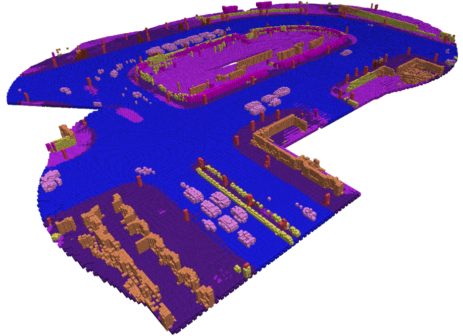

# Learning Aided Semantic Bayesian Kernel Inference

This work extends Lu et. al's original paper on Semantic BKI to operate in dynamic environments.



## Getting Started

### Building with catkin

```bash
catkin_ws/src$ git clone git@github.com:KingArthurZ3/LASt-BKI.git
catkin_ws/src$ cd ..
catkin_ws$ catkin_make
catkin_ws$ source ./devel/setup.bash
```

### Building using Intel C++ compiler (optional for better speed performance)
```
bash
catkin_ws$ source /opt/intel/compilers_and_libraries/linux/bin/compilervars.sh intel64
catkin_ws$ catkin_make -DCMAKE_C_COMPILER=icc -DCMAKE_CXX_COMPILER=icpc
catkin_ws$ source ~/catkin_ws/devel/setup.bash
```

## Semantic Mapping using CarlaSC dataset

### Download Data

Please download the Town10Heavy scene from [MotionSC_11](https://drive.google.com/drive/folders/1_Mom2vipQi3XoOtBoBYlQa_Pelf9rorR?usp=sharing) and uncompress it into the data folder. 
Rename the directory to `carla_townheavy`. These are predictions from the pretrained Neural Network MotionSC on CarlaSC.


### Running Rviz and BKI Layer

```
bash
catkin_ws$ roslaunch semantic_bki carla_node.launch
```
You will see an empty semantic map in RViz. Prepend the ros topic for the map (should be of type MarkerArray) with the ros node name `/carla_node/`

### Publishing MotionSC predictions for incoming point clouds

```
catkin_ws/src/BKINeuralNetwork$ cd ./data
catkin_ws/src/BKINeuralNetwork$ python3 publisher.py
```

Depending on the speed of your processor, you may need to change the default publish rate of the publisher.py file to avoid dropping point cloud scans. By default, 
we maintain a queue for storing unprocessed point cloud scenes temporarily. You will see semantic map in RViz. 

### Evaluation
Evaluation code is provided in `carla_benchmarking.ipynb`. You may modify the directory names to run it. Note: this file was originally run on google colab, users who run evaluations locally can simply replace google drive filepaths with local filepaths.

## Relevant Publications

If you found this code useful, please cite the following:

Bayesian Spatial Kernel Smoothing for Scalable Dense Semantic Mapping ([PDF](https://ieeexplore.ieee.org/stamp/stamp.jsp?tp=&arnumber=8954837))
```
@ARTICLE{gan2019bayesian,
author={L. {Gan} and R. {Zhang} and J. W. {Grizzle} and R. M. {Eustice} and M. {Ghaffari}},
journal={IEEE Robotics and Automation Letters},
title={Bayesian Spatial Kernel Smoothing for Scalable Dense Semantic Mapping},
year={2020},
volume={5},
number={2},
pages={790-797},
keywords={Mapping;semantic scene understanding;range sensing;RGB-D perception},
doi={10.1109/LRA.2020.2965390},
ISSN={2377-3774},
month={April},}
```

Learning-Aided 3-D Occupancy Mapping with Bayesian Generalized Kernel Inference ([PDF](https://ieeexplore.ieee.org/stamp/stamp.jsp?tp=&arnumber=8713569))
```
@article{Doherty2019,
  doi = {10.1109/tro.2019.2912487},
  url = {https://doi.org/10.1109/tro.2019.2912487},
  year = {2019},
  publisher = {Institute of Electrical and Electronics Engineers ({IEEE})},
  pages = {1--14},
  author = {Kevin Doherty and Tixiao Shan and Jinkun Wang and Brendan Englot},
  title = {Learning-Aided 3-D Occupancy Mapping With Bayesian Generalized Kernel Inference},
  journal = {{IEEE} Transactions on Robotics}
}
```
