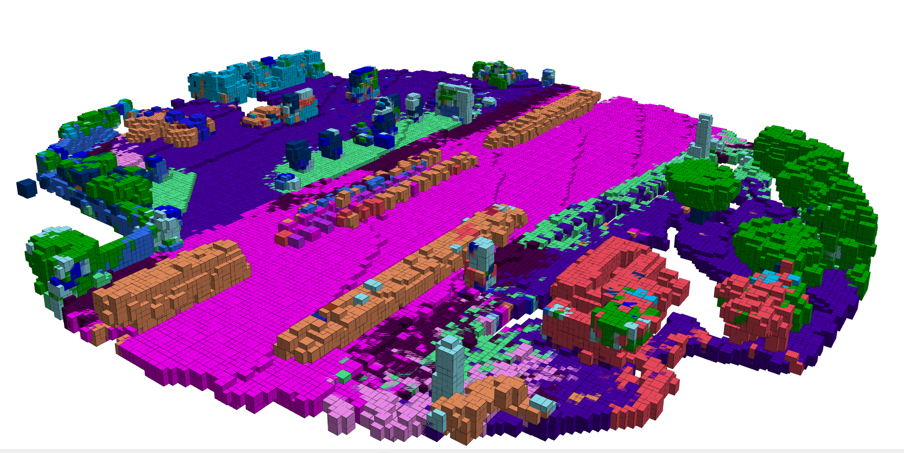

# BKI Neural Network

This work extends Lu et. al's original paper on Semantic BKI to operate in dynamic environments.



## Getting Started

### Building with catkin

```bash
catkin_ws/src$ git clone git@github.com:KingArthurZ3/BKINeuralNet.git
catkin_ws/src$ cd ..
catkin_ws$ catkin_make
catkin_ws$ source ~/catkin_ws/devel/setup.bash
```

### Building using Intel C++ compiler (optional for better speed performance)
```bash
catkin_ws$ source /opt/intel/compilers_and_libraries/linux/bin/compilervars.sh intel64
catkin_ws$ catkin_make -DCMAKE_C_COMPILER=icc -DCMAKE_CXX_COMPILER=icpc
catkin_ws$ source ~/catkin_ws/devel/setup.bash
```

### Running the Demo

```bash
$ roslaunch semantic_bki toy_example_node.launch
```

## Semantic Mapping using SemanticKITTI dataset

### Download Data
Please download [semantickitti_04](https://drive.google.com/file/d/19Dv1jQqf-VGKS2qvbygFlUzQoSvu17E5/view?usp=sharing) and uncompress it into the data folder.

### Running
```bash
$ roslaunch semantic_bki semantickitti_node.launch
```
You will see semantic map in RViz. It also query each ground truth point for evaluation, stored at data/semantickitti_04/evaluations.

### Evaluation
Evaluation code is provided in semantickitti_evaluation.ipynb. You may modify the directory names to run it, or follow the guideline in [semantic-kitti-api](https://github.com/PRBonn/semantic-kitti-api) for evaluation.


## Relevant Publications

If you found this code useful, please cite the following:

Bayesian Spatial Kernel Smoothing for Scalable Dense Semantic Mapping ([PDF](https://ieeexplore.ieee.org/stamp/stamp.jsp?tp=&arnumber=8954837))
```
@ARTICLE{gan2019bayesian,
author={L. {Gan} and R. {Zhang} and J. W. {Grizzle} and R. M. {Eustice} and M. {Ghaffari}},
journal={IEEE Robotics and Automation Letters},
title={Bayesian Spatial Kernel Smoothing for Scalable Dense Semantic Mapping},
year={2020},
volume={5},
number={2},
pages={790-797},
keywords={Mapping;semantic scene understanding;range sensing;RGB-D perception},
doi={10.1109/LRA.2020.2965390},
ISSN={2377-3774},
month={April},}
```

Learning-Aided 3-D Occupancy Mapping with Bayesian Generalized Kernel Inference ([PDF](https://ieeexplore.ieee.org/stamp/stamp.jsp?tp=&arnumber=8713569))
```
@article{Doherty2019,
  doi = {10.1109/tro.2019.2912487},
  url = {https://doi.org/10.1109/tro.2019.2912487},
  year = {2019},
  publisher = {Institute of Electrical and Electronics Engineers ({IEEE})},
  pages = {1--14},
  author = {Kevin Doherty and Tixiao Shan and Jinkun Wang and Brendan Englot},
  title = {Learning-Aided 3-D Occupancy Mapping With Bayesian Generalized Kernel Inference},
  journal = {{IEEE} Transactions on Robotics}
}
```
